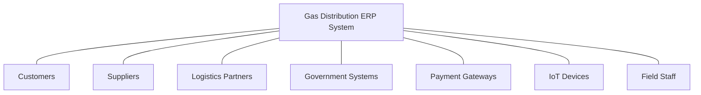
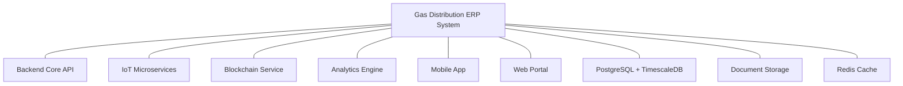
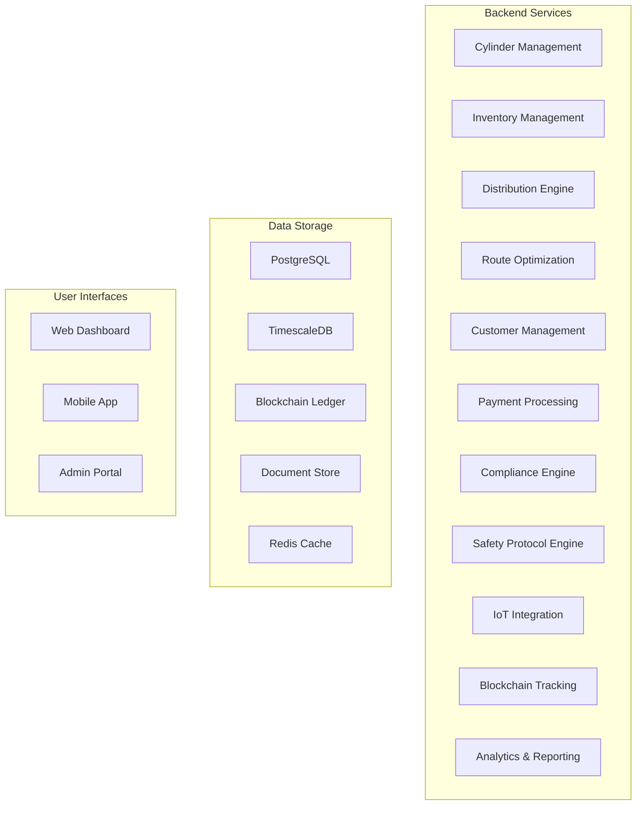
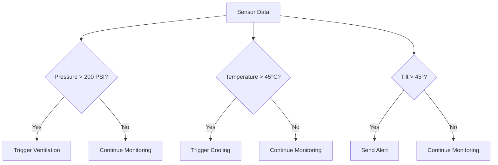

# Technical Specifications: Gas Distribution ERP System

## 1. System Architecture (C4 Model)

### Level 1: Context Diagram


### Level 2: Container Diagram


### Level 3: Component Diagram


## 2. Cylinder-Centric Architecture

### Digital Twin Implementation
- **RFID/NFC Integration**:
  - ISO/IEC 18000-63 compliant RFID tags with 96-bit EPC memory
  - Tag data will include: Cylinder ID, Type, Manufacturing Date, Last/Next Inspection Date
  - Read/write capabilities for status updates in the field
  - Fault-tolerance with data backup in central system

- **Blockchain Tracking**:
  - Private permissioned Hyperledger Fabric network
  - Smart contracts for cylinder ownership transfer events
  - Immutable audit trail for regulatory compliance
  - Integration with payment systems for deposit tracking

- **IoT Condition Monitoring**:
  - Sensors: Pressure (0-300 PSI), Temperature (-40°C to 85°C), Accelerometer (3-axis)
  - Data transmission: LoRaWAN for long-range, low-power communication
  - Edge processing for anomaly detection
  - Battery life: Minimum 5 years with hourly reporting

### Data Model Extensions

```typescript
// Cylinder entity enhancements
@Entity('cylinders')
export class Cylinder {
  @Column()
  rfidTag: string;

  @Column({ type: 'text', nullable: true })
  blockchainAssetId: string;

  @Column({ type: 'jsonb', nullable: true })
  lastTelemetryData: {
    pressure: number;
    temperature: number;
    orientation: {x: number, y: number, z: number};
    batteryLevel: number;
    signalStrength: number;
    lastReportTime: Date;
  };

  @Column({ type: 'jsonb', nullable: true })
  digitalTwinState: Record<string, any>;

  @Column({ type: 'text', nullable: true })
  currentOwnershipHash: string;
}

// CylinderOwnership entity for blockchain tracking
@Entity('cylinder_ownerships')
export class CylinderOwnership {
  @PrimaryGeneratedColumn()
  id: number;

  @ManyToOne(() => Cylinder)
  cylinder: Cylinder;

  @Column()
  ownerType: 'COMPANY' | 'CUSTOMER' | 'DISTRIBUTOR';

  @Column()
  ownerId: number;

  @Column()
  transferDate: Date;

  @Column()
  transactionHash: string;

  @Column({ type: 'decimal', precision: 10, scale: 2 })
  depositAmount: number;

  @Column()
  isActive: boolean;
}

// IoT Telemetry entity
@Entity('cylinder_telemetry')
export class CylinderTelemetry {
  @PrimaryGeneratedColumn()
  id: number;

  @ManyToOne(() => Cylinder)
  cylinder: Cylinder;

  @Column()
  timestamp: Date;

  @Column({ type: 'decimal', precision: 10, scale: 2 })
  pressure: number;

  @Column({ type: 'decimal', precision: 10, scale: 2 })
  temperature: number;

  @Column({ type: 'jsonb' })
  orientation: {x: number, y: number, z: number};

  @Column({ type: 'decimal', precision: 5, scale: 2 })
  batteryLevel: number;

  @Column({ type: 'decimal', precision: 5, scale: 2 })
  signalStrength: number;

  @Column({ type: 'point', nullable: true })
  gpsLocation: {x: number, y: number};
}
```

## 3. Multi-Warehouse Inventory Management

### Automated Stock Reconciliation
- **Algorithm**: Real-time perpetual inventory system with periodic physical reconciliation
- **Variance Handling**:
  - Automated threshold-based alerts (>±2% variance)
  - Root cause analysis workflow
  - Adjustment approval process with multi-level authorization

### 3D Bin Mapping
- **Technology**: Three.js-based visualization with spatial database
- **Data Structure**:
```typescript
interface StorageLocation {
  warehouse: string;
  zone: string;
  aisle: string;
  rack: string;
  shelf: string;
  bin: string;
  position: {x: number, y: number, z: number};
  dimensions: {width: number, height: number, depth: number};
  maxWeight: number;
  cylinderType: string[];
  hazardRestrictions: string[];
  currentCylinders: Cylinder[];
  utilizationPercentage: number;
}
```

### Damage Prediction Model
- **Machine Learning Approach**: Random Forest classifier with time-series features
- **Input Features**:
  - Cylinder age
  - Number of refill cycles
  - Pressure fluctuation patterns
  - Temperature exposure history
  - Impact/tilt event frequency
  - Transport distance
  - Customer handling score
- **Output**: Probability of failure within next 30/60/90 days
- **Maintenance Trigger**: Automated work order generation when failure probability > 25%
- **Continuous Learning**: Model retraining monthly with new failure data

## 4. Dynamic Distribution Engine

### Hybrid Route Optimization
- **Core Algorithm**: Google OR-Tools VRP Solver
- **Custom ML Enhancement**:
  - Traffic prediction model using historical traffic data + weather patterns
  - Customer time window prediction based on past delivery patterns
  - Priority scoring based on customer type, cylinder contents, and urgency
- **Constraints**:
  - Vehicle capacity (volume/weight)
  - Driver working hours
  - Hazardous material restrictions
  - Special handling requirements
  - Customer delivery windows

### Driver Performance Analytics
- **Metrics Tracked**:
  - Deliveries per hour
  - On-time delivery percentage
  - Fuel efficiency
  - Safety protocol adherence
  - Customer satisfaction scores
  - Vehicle condition reports
- **Benchmarking**: Driver performance percentile ranking within similar route types
- **Gamification**: Tiered rewards system based on performance metrics
- **Training Integration**: Automated identification of training needs based on performance gaps

### Automated Load Balancing
- **Branch Network Optimization**:
  - Daily inventory rebalancing between branches based on demand forecasting
  - Transfer recommendation engine for cylinder types and quantities
  - Emergency stock sharing protocol for critical shortages
  - Seasonal adjustment algorithms based on historical patterns

## 5. Technical Stack Implementation

### Backend Architecture
- **Core API**: NestJS with TypeScript
  - Modular, scalable architecture with dependency injection
  - OpenAPI documentation with Swagger
  - JWT-based authentication with role-based access control
  - Request validation using class-validator

- **IoT Microservices**: Node.js with Express
  - Protocol adapters for MQTT, HTTP, and CoAP
  - Message queue integration with RabbitMQ
  - Device registry and provisioning service
  - Real-time data processing with Apache Kafka

- **Database Layer**:
  - PostgreSQL for transactional data
  - TimescaleDB extension for time-series sensor data
  - Redis for caching and real-time messaging
  - Automated data partitioning and archiving strategies

### Frontend Implementation
- **Web Application**:
  - React SPA with TypeScript
  - Material-UI component library with custom theme
  - Redux toolkit for state management
  - Progressive Web App capabilities
  - Responsive design for desktop/tablet use

- **Mobile Application**:
  - React Native with TypeScript
  - Offline-first architecture with synchronization
  - Push notifications for alerts and status updates
  - Barcode/RFID scanning capabilities
  - Geolocation features for delivery tracking

### Integration Layers
- **Payment Gateway Integration**:
  - bKash integration with split payment capability
  - Nagad integration with direct settlement
  - Custom PCI-DSS 4.0 compliant payment processor
  - Escrow system for cylinder deposits

- **Government Systems**:
  - VAT 6.3 API integration for automated filing
  - NBR TIN validation service
  - BGMEA compliance reporting
  - Explosives Act 1884 documentation management

- **Safety Systems**:
  - ISO 11515 gas leak detection protocols
  - Real-time alert system for safety threshold violations
  - Automatic emergency service notification
  - Safety procedure documentation display

## 6. Compliance & Safety Protocols

### Regulatory Compliance
- **Automated Compliance Checks**:
  - BGMEA standards verification
  - Bangladesh Explosives Act 1884 requirements
  - Periodic audit document generation
  - Expiry notifications for licenses and certifications

### Safety Protocol Engine
- **Threshold Monitoring**:


### Data Protection
- **GDPR-grade Security Measures**:
  - End-to-end encryption for customer data
  - Pseudonymization of personal information
  - Automated data retention policies
  - Access control and audit logging
  - Right to erasure workflow for customer data

## 7. Reporting & Analytics

### Cylinder Lifecycle Reports
- **Maintenance Cost Tracking**:
  - Cost per cylinder over lifetime
  - Cost breakdown by maintenance type
  - MTBF (Mean Time Between Failures) analysis
  - Comparison across cylinder types and manufacturers

- **Refill Cycle Analysis**:
  - Efficiency metrics by cylinder type
  - Seasonal variation analysis
  - Customer usage patterns
  - Refill station performance comparison

- **Loss Prevention**:
  - Cylinder non-return rate by customer segment
  - Geographical analysis of losses
  - Correlation analysis with delivery staff
  - Deposit effectiveness analysis

### Financial Reconciliation
- **Deposit Management**:
  - Current deposit liability tracking
  - Aging analysis of deposits
  - Forfeiture prediction modeling
  - Deposit balance reconciliation

- **Profitability Analysis**:
  - Rental vs. sales comparison
  - Customer segment profitability
  - Product type margin analysis
  - Branch performance comparison

- **VAT Integration**:
  - Automated VAT 6.3 report generation
  - Tax liability forecasting
  - Input-output tax correlation
  - Exception handling for non-standard transactions

## 8. Implementation Roadmap

### Phase 1: Foundation (Months 1-3)
- Core data model implementation
- Basic inventory management
- Customer and supplier management
- Basic reporting functionality
- User management and access control

### Phase 2: Cylinder Tracking (Months 4-6)
- RFID/NFC integration
- Cylinder digital twin implementation
- Basic IoT sensor integration
- Inventory reconciliation algorithms
- Mobile scanning application

### Phase 3: Distribution Engine (Months 7-9)
- Route optimization implementation
- Driver mobile application
- Real-time delivery tracking
- Branch inventory balancing
- Customer delivery portal

### Phase 4: Advanced Features (Months 10-12)
- Blockchain ownership tracking
- Advanced analytics and reporting
- AI-based damage prediction
- Government system integrations
- Safety protocol engine

### Phase 5: Optimization (Months 13-15)
- Performance tuning
- Scalability enhancements
- Advanced IoT integration
- Machine learning model refinement
- Business intelligence dashboards

## 9. Technical Debt Prevention

### Cylinder ID Schema Future-Proofing
- Use of UUID v4 for all cylinder identifiers
- Namespace reservation for future expansion
- Version field in all serialization formats
- Migration framework for schema evolution
- Backwards compatibility layer for legacy systems

### Multi-Gas Type Expansion
- Gas type abstraction layer in data model
- Parameterized safety protocols by gas type
- Extensible property system for gas-specific attributes
- Configurable UI components adaptable to gas properties
- Isolated test environments for new gas type validation

### Regional Regulation Adaptation
- Configuration-driven compliance rules engine
- Pluggable validation modules for different jurisdictions
- Document template system with regional variations
- Audit trail with regulation version tracking
- Scheduled compliance check automation

## 10. Disaster Recovery

### Cylinder Tracking Failures
- Real-time data replication to geographically distributed backup systems
- Offline mode for mobile applications with sync queue
- Blockchain-based reconciliation for ownership disputes
- Manual override procedures with multi-level approval
- Automated recovery testing schedule

### Data Integrity Protection
- Transaction logs with point-in-time recovery
- Regular automated database integrity checks
- Application-level validation against data corruption
- Cryptographic verification of critical data elements
- Audit logging of all data modifications

### Business Continuity Plan
- Automated failover to backup systems
- Recovery Time Objective (RTO): 15 minutes
- Recovery Point Objective (RPO): 5 minutes
- Regular disaster simulation exercises
- Documented manual processes for system unavailability